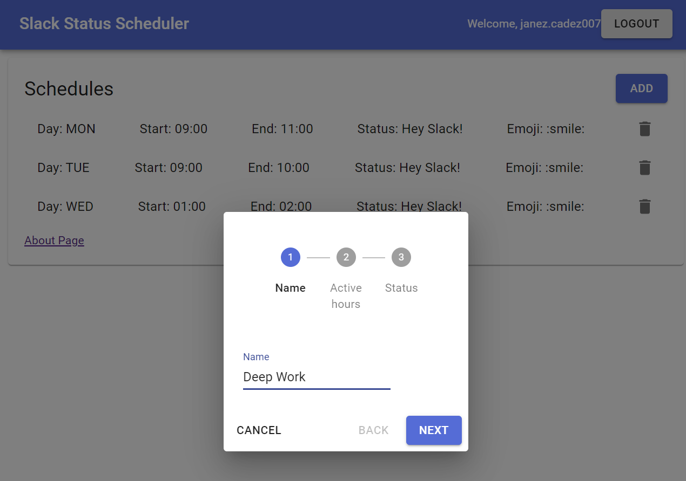

# Status Scheduler for Slack

Status Scheduler for Slack is a tool that let's you create automatic schedules in Slack with your custom status, emoji and Do Not Disturb preference.

  

## Target Audience

- Users of Slack messaging platform
- People who regularly work from home and write custom status
- People who want to schedule deep work time with a custom status and DnD preference

## How It Works

- We are using AgendaJS to create cron job for each day of the created schedule.
- A job is called when the schedule gets executed and we update the status and preference via the Slack API

## Tech Stack

- NextJS
- NodeJS (AgendaJS)
